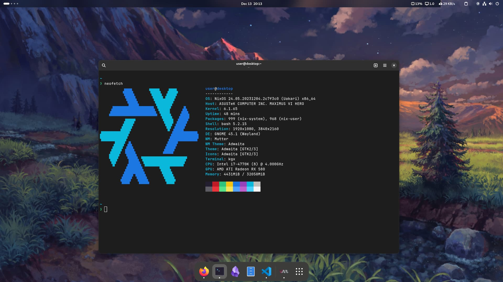

# My NixOS Configuration



Secrets are encrypted by the hosts' own SSH key via `sops-nix`.

<details>
<summary>Todo</summary>

- [ ] Test: override ffmpeg back to without lib_fdkaac (probably override config?)
- [ ] Gnome DND on timer
- [ ] Background change on morning and night with randomization of wallpapers (choose wallpapers first)
- [ ] Desktop: see if vscode insiders fixes blurry issue
- [ ] automated updates: move to git, autodeployment
- [ ] nnn: cd on quit, fzf-like search
- [ ] Default applications for PDF, text files
- [ ] Hyprland
- [ ] Impermanence module

</details>

## Configuration

Each host configuration is specified by the following files in `hosts/${hostname}`:

- `home.nix`
- `system.nix`
- `hardware-configuration.nix` (generated by `nixos-generate-config`)
- Optionally, other files as resources e.g. `monitors.xml`

They also inherit configurations from `common/`:

- `home.nix`
- `home-overrides.nix`
- `system.nix`
- `system-overrides.nix`

## Install

An encrypted root ([LVM over LUKS]) with zram will be setup. Root account is disabled.

> [!IMPORTANT]
> Before installing anything, back up your existing configuration:
>
> - Firefox profiles
> - `/etc/fstab` (if applicable)
> - `nm-cli` connections (if applicable)
> - VM images (if applicable)

Boot into the NixOS [installer].

Then, run:

```text
$ sudo -i
# source <(curl -s https://raw.githubusercontent.com/extrange/nixos-config/main/setup.sh)
```

Enter SSH login details when prompted.

Once installation is completed successfully, reboot.

## Post Install

- `git push` changes to `hardware-configuration.nix` for the respective host
- Pull Firefox profile
- Setup logins (these can't be declaratively set)
  - Tailscale (Auth Key max expiry is 90 days)
  - Telegram
  - Whatsapp
- Syncthing: configure folders, add device to server
- GSConnect pairing
- VSCode settings sync (note: due to [automatic login], the keyring is not unlocked. However, it is possible to use a insecure storage and disable the [password].)

## Notes

- To edit `sops` secrets, use `SOPS_AGE_KEY=$(ssh-to-age -private-key -i ~/.ssh/id_ed25519) sops secrets.yaml`.
- To add a new key for a host:
  - First, get the `age` key from the SSH public key: `ssh-keygen -y -f path/to/public/key | ssh-to-age`
  - Add the key to `.sops.yaml`
  - Update: `SOPS_AGE_KEY=$(ssh-to-age -private-key -i path/to/private/key sops updatekeys secrets.yaml` (the private key must have previously used to encrypt the file)
- `nixos-rebuild switch --flake .#hostname` will not allow access to untracked files. To [work around] this, do `nixos-rebuild switch --flake path:.#hostname`.
- Using `read` in `curl ... | bash` doesn't work as `read` does not have access to the terminal, so `source` is used instead.

## Resources

- Dotfiles: [dmadisetti], [Electrostasy], [reckenrode]
- Hyprland configs: [yurihikari], [Waayway]
- [Comparison of `git-crypt`, `agenix` and `sops-nix`][secrets]

[secrets]: https://lgug2z.com/articles/handling-secrets-in-nixos-an-overview/
[Waayway]: https://github.com/Waayway/hyprland-waayway
[yurihikari]: https://github.com/yurihikari/garuda-sway-config
[electrostasy]: https://github.com/Electrostasy/dots
[reckenrode]: https://github.com/reckenrode/nixos-configs
[dmadisetti]: https://github.com/dmadisetti/.dots
[work around]: https://discourse.nixos.org/t/dirty-nixos-rebuild-build-flake-issues/30078/2
[LVM over LUKS]: https://wiki.archlinux.org/title/dm-crypt/Encrypting_an_entire_system#LVM_on_LUKS
[installer]: https://channels.nixos.org/nixos-23.11/latest-nixos-minimal-x86_64-linux.iso
[automatic login]: https://askubuntu.com/questions/1352398/asking-for-password-when-i-open-vscode-for-the-first-time
[password]: https://askubuntu.com/questions/24770/gnome-keyring-keeps-asking-for-a-password-that-doesnt-exist/24773#24773
