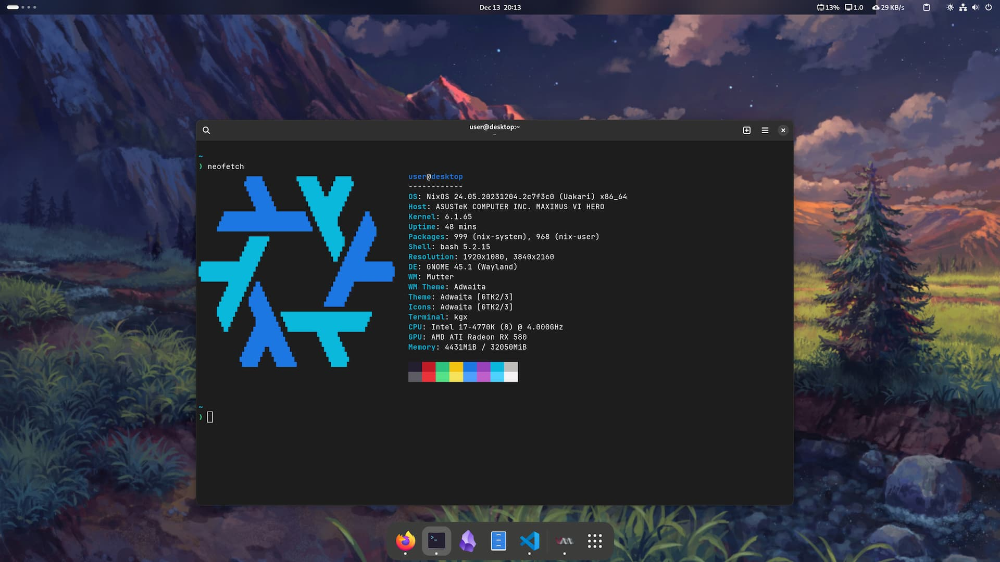

# My NixOS Configuration



[Useful Commands]

## Hosts

| Name     | Description                                       |
| -------- | ------------------------------------------------- |
| [server] | Runs my homelab and hosts the bulk of my data.    |
| zephyr   | Portal device, runs `windows-vm`.                 |
| io       | Runs on a VPS. For logging and uptime monitoring. |
| laptop   | Portal device.                                    |

## Setting up a new host

> All mobile hosts with SSH access to your server should have encrypted storage (e.g. TPM/Android encryption).

### Create the config

Add the host's config (and optionally [disko]'s config) under `hosts/`.

### Generate the host's SSH key

Generate the host user's SSH key and place it in `server`'s `~/keys`. This key encrypts/decrypts sops secrets in `secrets.yaml`.

### Register the host's age key

```bash
AGE_KEY=$(ssh-to-age -i /path/to/public/key) \
  yq 'with(.creation_rules[0].key_groups[0].age;  . += env(AGE_KEY) | .[-1] line_comment="host-name")' -i .sops.yaml
```

### Update secrets.yaml

From another host whose key is already registered:

```bash
SOPS_AGE_KEY=$(ssh-to-age -private-key -i ~/.ssh/id_ed25519) \
  sops updatekeys secrets.yaml
```

### (Optional) Allow SSH access to your servers

Add this host's SSH key to `common-opt/allowSsh.nix`.

### Copy SSH key to temporary folder

This is later copied over by nixos-anywhere's `--extra-files` to the host.

```bash
temp=$(mktemp -d)
ssh_dir="$temp/home/user/.ssh"

mkdir -p "$ssh_dir"

scp <path-to-host-key> "$ssh_dir/id_ed25519"
```

### (optional) Copy Secure Boot keys to temporary folder

Required if using Lanzaboote.

```bash
nix shell nixpkgs#sbctl
sudo sbctl create-keys                        # writes /var/lib/sbctl/keys
mkdir -p "$temp/var/lib/sbctl"
sudo cp -r /var/lib/sbctl/keys "$temp/var/lib/sbctl/"
sudo chown -R user "$temp/var/lib/sbctl/"
```

### Deploy via nixos-anywhere

Copy the host's SSH key to a temporary directory, then install via nixos-anywhere:

```bash

nix run github:nix-community/nixos-anywhere -- \
  --flake <path-to-flake> \
  --target-host <host@server> \
  --extra-files "$temp" \
  --chown "/home/user/.ssh" 1000:1000
```

### (optional) Enroll LUKS key into TPM

```bash
sudo systemd-cryptenroll \
  --tpm2-device=auto \
  --tpm2-with-pin=true \
  --tpm2-pcrlock=/var/lib/systemd/pcrlock.json \
  /dev/sdX
```

### Add the host key to known keys

```bash
ssh-keyscan -t ed25519 hostname
```

Add the output to `programs.ssh.knownHosts`.

_Note: For systems using TPM2 with Secure Boot, ensure that Secure Boot is disabled during the installation. Follow the instructions [here][lanzaboote] to enroll the Secure Boot keys post-installation. After that, enroll the LUKS key into the TPM following the instructions on the [NixOS Wiki][nixos-tpm-wiki]._

### Post Install

Setup logins (these can't be declaratively set)

- Tailscale
- Telegram
- Whatsapp
- GSConnect pairing

## Resources

- Dotfiles: [dmadisetti], [Electrostasy], [reckenrode]
- Hyprland configs: [yurihikari], [Waayway]
- [Comparison of `git-crypt`, `agenix` and `sops-nix`][secrets]

[secrets]: https://lgug2z.com/articles/handling-secrets-in-nixos-an-overview/
[Waayway]: https://github.com/Waayway/hyprland-waayway
[yurihikari]: https://github.com/yurihikari/garuda-sway-config
[electrostasy]: https://github.com/Electrostasy/dots
[reckenrode]: https://github.com/reckenrode/nixos-configs
[dmadisetti]: https://github.com/dmadisetti/.dots
[Useful Commands]: useful-commands.md
[server]: hosts/server/server.md
[nixos-anywhere]: https://github.com/nix-community/nixos-anywhere
[disko]: https://github.com/nix-community/disko
[lanzaboote]: https://github.com/nix-community/lanzaboote/blob/master/docs/getting-started/prepare-your-system.md
[nixos-tpm-wiki]: https://wiki.nixos.org/wiki/Full_Disk_Encryption#TPM2
